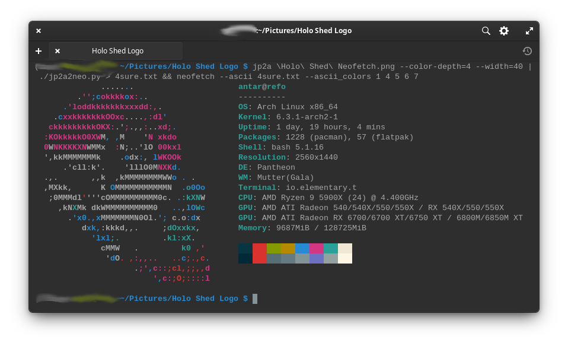

# A Font of Text Configurations

Holo Shed OS for the Win4 is going remarkably well.
Having a physical keyboard and a
["native"](https://www.youtube.com/watch?v=Ovp7jrJdLAc)
landscape display has made the work of developing
a bespoke Linux distro way easier than it would
have been on the Steam Deck.

## Old Man Eyes

Of course, Linuxing on the Win4 does have its downsides
in the form of a 6" FHD display that makes the text show
up way too small out of the box, at least for my aging
eyeballs. X11, GTK/GNOME and Pantheon do all theoretically
support "HiDPI" modes and scaling, but those Three Stooges get in
each other's way more often than not. Instead, the most reliable
solution I've found is grabbing
[Dconf Editor](https://wiki.gnome.org/Apps/DconfEditor) and
just searching for any setting for "font" or "size." Having
an interactive tool for this has been ace, by the way, since
you can preview (and revert) settings extremwely quickly.

Here's a list of everything I changed (conveniently grabbed
from the CLI by running `dconf dump /`:

```ini
[ca/desrt/dconf-editor]
saved-pathbar-path='/org/gnome/gedit/plugins/externaltools/font'
window-height=443
window-width=894

[desktop/ibus/panel]
custom-font='Sans 14' ; will probably bump this higher


[io/elementary/files/file-chooser]
window-size=(892, 450)

[io/elementary/files/preferences]
sidebar-width=191
window-size=(1000, 680)

[io/elementary/terminal/settings]
font='Monospace 14'
natural-copy-paste=false
prefer-dark-style=true
theme='dark'

[org/gnome/desktop/interface]
cursor-size=36
document-font-name='Open Sans 16'
font-name='Inter 12'
monospace-font-name='SourceCodeVF 16'
scaling-factor=uint32 1
text-scaling-factor=1.0

[org/gnome/desktop/wm/preferences]
titlebar-font='Cantarell Bold 18'

[org/gnome/font-manager]
compare-background-color='rgb(255,255,255)'
compare-foreground-color='rgb(0,0,0)'
compare-list=@as []
content-pane-position=187
google-fonts-background-color='rgb(255,255,255)'
google-fonts-foreground-color='rgb(0,0,0)'
language-filter-list=@as []
selected-category='7:1'
selected-font='13'
window-size=(900, 467)

[org/gnome/font-manager/font-viewer]
preview-font-size=16.0

[org/gnome/gedit/plugins/externaltools]
font='Monospace 14'

[org/gnome/libgnomekbd/indicator]
font-size=12
```

and thats's the Pantheon desktop sorted!

## The Console

The TTY consoles was a bit trickier, but
[the Arch wiki](https://wiki.archlinux.org/title/Linux_console#Fonts)
came through, as it so often does, and now
everything is a reasonable size, even on first boot,
thanks to an `/etc/vconsole.conf` of:

```ini
FONT=ter-v28b
```

## The Most Important Thing

But speaking of the terminal, easily my biggest accomplishment so far is
that I've made a custom `neofetch` logo for Holo Shed OS:



Since I'm no ASCII art guru, this was a good-sized project:

- There's a utility called [`jp2a`](https://github.com/cslarsen/jp2a)
  that will convert an image to ASCII art
- But it does it with ANSI codes
- And `neofetch` (which hasn't been updated since 2021)
  [doesn't work with ANSI codes](https://github.com/dylanaraps/neofetch/issues/1768)

Enter my own solution: [`jp2a2neo.py`](https://github.com/Holo-Shed/neofetch/blob/main/jp2a2neo.py),
a ridiculously simple script to bridge the gap between the two programs:

starting with an image like:


and then running the command:

```bash
jp2a logo.png --color-depth=4 --width=48 | ./jp2a2neofetch.py > neofetch_logo.txt
```

resulted in an output I could then paste
[directly into the `neofetch` executable](https://github.com/holo-shed/neofetch/commit/cceb174bd1dd4ae9c3139e4ed1beb08d63646a42),
yielding the awesome result you see above.

So yeah, I'm feeling pretty proud of myself.
