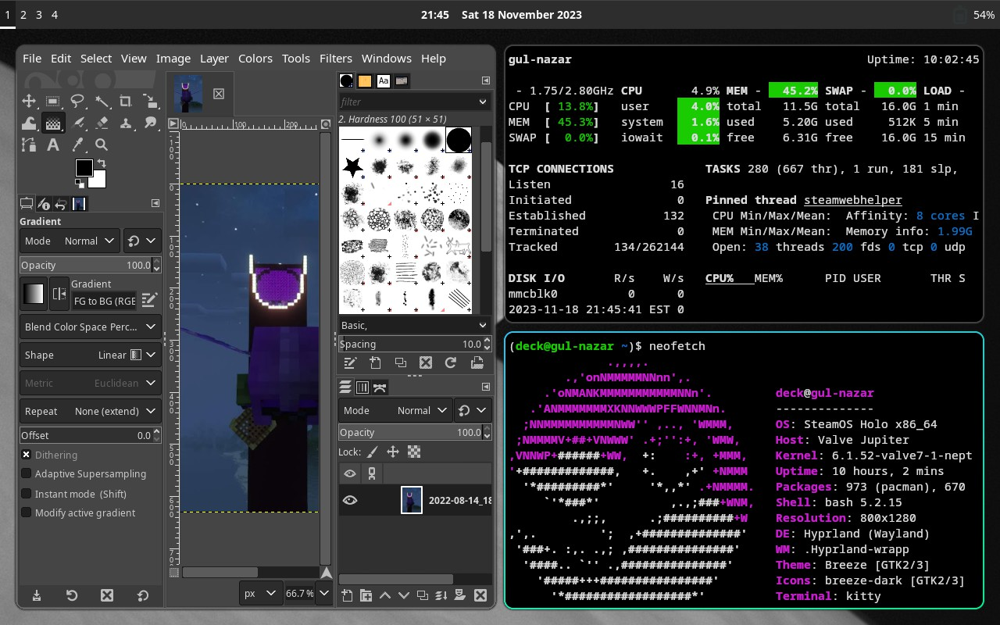

# Nixing it Up: Holo Shed on the Deck

The "Holo Shed" experience on my GPD Win4 is going well—so well that there's honestly not really much to write up.
Frankly, it's not meaningfully different than Arch on my desktop, aside from [the font settings](../03-most-important-thing)
and my input-remapper configuration.

But this past week's surprise drop of the [Steam Deck OLED](https://www.youtube.com/watch?v=_vTsZMvjJ-A) afforded me a
chance to revisit this project's original concept of customizing _SteamOS_ into a more effective cyberdeck solution.
By that I **do not** mean that I went out and bought a third console PC, I mean that in order to ship these new
devices with HDR support, Valve _finally_ pushed the long-awaited
[SteamOS 3.5](https://store.steampowered.com/news/app/1675200/view/5484882897552407488) to Stable.

This is easily the biggest change to the Deck's software since I got mine in September 2022, with a _huge_
bump to the Linux kernel
([the fn keys on my Keychron K7 finally work like they're supposed to!](https://www.phoronix.com/news/Keychron-Keyboards-Linux-5.19)),
badly-needed updates to modern versions of the installed [Python](https://github.com/OpenBagTwo/gsb/issues/38) and Git executables,
and, most interestingly, a pre-configured `/nix` overlay partition.

Now, I've never used NixOS before, but I sure have heard a lot of hype around
[the "declarative" package management system](https://nixos-and-flakes.thiscute.world/introduction/)
and how robust Nix's approach to software installation is. The details are beyond the scope
of this project, and I strongly suspect I am _not_ taking full advantage of
[Nix's declarative workflows](https://discourse.nixos.org/t/transitioning-from-imperative-to-declarative-package-management-with-nix-alone/28728)
so let me just give the **tl;dr—with SteamOS 3.5 you can now _safely_ install system packages in a way that does not touch SteamOS' underlying
read only filesystem and which should have no issues surviving software updates.**

This is in sharp contrast to [rwfus](https://github.com/ValShaped/rwfus), the overlay tool I'd been using up to this point, which, while
also using an overlay to avoid messing with the base file system,
could easily break your SteamOS if a package you manually installed conflicted with the version expected by SteamOS.

So even though I had a pretty good setup at this point—I had [Sway](https://swaywm.org/) launchable from Gaming Mode as a "non-Steam app"
and an experimental version of OBS working that supported recording through Gaming Mode—I had a few reasons to expect
my rwfus overlay was going to seriously break with the OS upgrade, and rather than fix the broken pieces, I decided a better strategy
would be to rebuild my "Holo Shed" Deck overlay from scratch.

## Step Negative One: Back up Everything

I actually take a large amount of pride in my backup hygeine—while I never got systemd timers working, I was really good about
running a backup script every time I ran a software update (either Steam or overlaid `pacman`). I thought about making full partition
images as well—thanks to me moving most of my Steam library to a separate data partition I'd created on my SSD, I actually had plenty
of space to write a full disk image of my `/home` partition to my microSD—but looking over my backups, I actually felt confident that
I had all my important files already stored away, so I didn't bother.

## Step Zero: Re-image the Deck

Valve has [excellent docs for this](https://help.steampowered.com/en/faqs/view/1B71-EDF2-EB6D-2BB3), and the hardest part for me
was finding an 8+ GB thumb drive (since my prior experience was that the recovery ISO isn't compatible with
[Ventoy](https://www.ventoy.net/en/index.html) 😡).

My process—which I had to be careful about, given that I had that giant data partition I _did't_ want reformatted—was
as follows:

1. Download the recovery ISO and burn it to a flash drive
1. Boot to the recovery image
1. Click the launcher to delete all **user data** (pretty sure this just completely wipes `/home/deck`)
1. Click the launcher to reinstall the OS. I really like that there's a little console that pops up in the background that tells you what's
   going on in terms of the partitions being deleted or rewritten.
1. Once that completes, eject the drive and boot. Go through the setup and, in Gaming Mode settings (system tab), change the hostname.
1. Then launch Desktop Mode.
1. Open a console and set a password using the `passwd` command. Then enable SSH via:

   ```bash
   sudo systemctl enable sshd
   ```

1. Verify that ssh is working via:

   ```bash
   ssh localhost
   ```

   It was at this point that I realized that, while I backed up all of my SSH _user_ keys **I didn't grab
   [my _host_ keys](https://www.ssh.com/academy/ssh/host-key#host-keys-in-openssh) from `/etc/ssh`** 😭.
   This meant my next half-hour was spent `ssh-copy-id`-ing into all of my other machines and then removing old
   entries from `known_hosts`. 0/10—Would not recommend.
1. Restore _some_ backed up files. My `.bashrc` wasn't going to work until I had some extra pacakges installed, but
   I could go ahead and bring over my `.vimrc`, at least.

## Adding My Own Overlay

So as I mentioned above, I prefer to keep my home folder with all of its user configurations and (in this case) Steam shenanigans
separate from the bulk of my _actual data_, which I store on a separate partition on my machines' internal SSDs. I usually mount
that partition as `/main`, but on SteamOS, the `/main` mount point can't be created because of the read-only file system—I can't create even
an empty directory at that location. I _could_ mount my data as `/mnt/main`, and prior to SteamOS 3.5 I actually had it mounted at
`/home/deck/main`, but I was feeling stubborn and determined, so I decided instead to ask myself, "well, how does `/nix` exist?"

I found the answer to that question in [this guide](https://determinate.systems/posts/nix-on-the-steam-deck), written before
SteamOS 3.5 entered preview, and I adapted their instructions for creating a bind-mount:

1. Create a mount-point at `/mnt/main`, which _is_ writeable (and preferrable to `/run/media`, at least to me)
1. Add the partition to `/etc/fstab` (also writeable)
1. In `/etc/systemd/system` create a `main-directory.service` (following the template of `nix-directory.service`) and `main.mount`
   (following their template for `nix.mount`)
1. Instead of bothering with a third, `ensure-symlinked-units-resolve.service`, I instead added:

   ```ini
   [Install]
   WantedBy=sysinit.target
   ```

   to both of the files created in the previous step
1. Finally, I ran `sudo systemctl daemon-reload` and `sudo systemctl enable --now` for both `main-directory` and `main.mount` and made sure
   everything was working and would work automatically after a reboot by, well, rebooting.
1. With that done, I ran through my usual process of removing all of my home folders with symlinks to `/main`:

   ```bash
   for folder in Downloads Documents Music Pictures Videos
   do
       rmdir $folder && ln -s /main/$folder
   done
   ```

At the end of the day, _was it really worth it_ to be able to access my files from `/main` instead of `/mnt/main`, _especially_ given that most
of my directories were accessible via `~/$folder` anyway? **No, it was not,** and if a future update breaks these services, I'm not going to fix
them.

## Installing Nix

It's weird to me that Valve would go to all the trouble of setting up the overlay partition and the bind-mount for Nix, but
not actually ship the Nix package manager itself. I guess it could be a licensing issue? Or they really want to make sure that
people installing things with Nix know what they're doing?

In any case, I was honestly shocked at how easy this part was. You could follow the rest of that guide I linked in the previous section,
but [the Arch Wiki](https://wiki.archlinux.org/title/Nix) is actually really concise here:

1. `curl --proto '=https' --tlsv1.2 -sSfL https://nixos.org/nix/install -o nix-install.sh`
1. View the script before running it. Yes, that's definitely good practice and something I absolutely did.
1. `./nix-install.sh --daemon`
1. Enable and start the daemon `sudo sysytemctl enable --now nix-daemon`

!!! note
    For some reason, my `nix-daemon` still needs to be restarted after every reboot.

## What essentials do I actually need to install?

Prior to 3.5, the software that shipped with SteamOS was _so old_ that I **had** to install essential
dependencies in a virtual environment. But 3.5.5 ships with:

- Python 3.11.3, which is new enough for me (Arch doesn't even have a non-AUR package for 3.12 as of this writing)
- Git 2.41.0 is only one minor version behind my Arch system
- Rsync 3.2.7 _is up-to-date!_
- Vim 9.0 ([RIP Bram Moolenaar](https://www.theregister.com/2023/08/07/bram_moolenaar_obituary/))
- tmux came pre-installed, unlike before (no Screen, but I really should be trying to use tmux anyway).

So that left relatively few essential pieces of command-line software:

```bash
nix-channel --add https://nixos.org/channels/nixpkgs-unstable
nix-channel --update
nix-env -iA nixpkgs.lolcat nixpkgs.pipx nixpkgs.glances nixpkgs.asciiquarium nixpkgs.sl nixpkgs.neofetch
```

And with `pipx` installed I could then add my [other](https://openbagtwo.github.io/EnderChest) [essentials](https://openbagtwo.github.io/gsb)

```bash
pipx install enderchest gsb
pipx --ensure-path
```

With `lolcat` back on my system, I could now bring over my `.bashrc`, but I actually ended up doing a line-by-line merge
with the fresh copy Valve included, since a lot of the workarounds I'd added to my script previously were no longer needed.

## Rebuilding my system

Steam did a great job of restoring all my Steam save files (with the exception of _Minecraft Legends_, which is weird, because I thought that was a Microsoft cloud save anyway)
and controller layouts, even for my non-Steam games, but because I (intentionally) only backed up my flatpak _data_ and not the executables (or permisison overrides themselves)
I then had quite a bit of work installing flatpaks, configuring permissions, fixing broken symlinks (`~/main` → `/mnt/main`) and creating launchers in Steam.
But that's honestly fine, because I honestly neither needed nor wanted "non-Steam game" launchers for all the software I had before—through months of use I'd found it to be a
much better experience to launch Firefox, GIMP or Avidemux through Sway than as a "game," confined to their own stand-alone session.

## Time for Tiling

With my flatpaks installed, it was now time to grab the software that could only come from Nix. I decided to start with the [kitty](https://sw.kovidgoyal.net/kitty/) terminal:

```bash
nix-env -iA nixpkgs.kitty
```

and immediately ran into the snag that it couldn't initialize OpenGL. Luckily, [this was covered in the Arch wiki](https://wiki.archlinux.org/title/Nix#Graphical_acceleration):

```bash
nix-channel --add https://github.com/guibou/nixGL/archive/main.tar.gz nixgl
nix-channel --update
nix-env -iA nixgl.auto.nixGLDefault
```

and then I could launch `kitty` via:

```bash
nixGL kitty
```

With that working, I started on [Hyprland](https://wiki.hyprland.org/), which I've been playing around with on my GPD Win4
and just find a little snazzier out-of-the-box than Sway.

```bash
nix-env -iA nixpkgs.hyprland nixpkgs.hyprpaper nixpkgs.imv nixpkgs.ironbar nixpkgs.mako nixpkgs.thunar nixpkgs.tofi
```

and, once installed, I switched over to a TTY (external keyboard required) and launched Hyprland via:

```bash
gamescope nixGL Hyprland
```

Since the Steam Deck uses a native portrait display, that meant that out of the box, Hyprland would have launched sideways without running
through gamescope. Using gamescope for my testing had the further advantage of simulating what I would be doing in the end, which is
running my WM through Gaming Mode.

With these tests completed, I then created Steam launchers and booted to gaming mode where... nothing worked. The "games" crashed immediately,
and the logs told me nothing. Miraculously, I found [this blog post](https://guacamolie.nl/en/blog/sway-on-the-steam-deck/) which outlined
both _the exact cause_ of my issue and _the exact solution_:

> ```bash
> # Steam resets the PATH, so source nix again to restore it
> source /etc/profile.d/nix.sh
> ```

By adding the above to a launch script, I could now launch Hyprland, kitty or any other
[Nix-installed application](https://github.com/Pingus/pingus) from Gaming Mode.

**Success!!** Guacamolie, if we ever meet in real life, I owe you a beverage of your choosing.

### Tips for Tiling in Gaming Mode

The whole reason why I wanted to get a tiling WM working in Gaming Mode is not only so I can easily jump back-and-forth between a web browser,
terminal or video editing app and an actual game, but because Steam Input + keyboard-heavy Tiling WMs is an _overpowered_ combination. On my
Win4, I've been using [input-remapper](https://github.com/sezanzeb/input-remapper) to allow me to use desktop controls without using GPD's
built-in keybinds, but Steam Input is just more convenient to configure and use from SteamOS. My general strategy is to do all of my
configurating _in_ Steam Input and target an application or game's default keybinds, but in the case of Hyprland I needed to make a few alterations due to
Steam for some reason not binding to the Super (Win) key. I also needed to tweak the monitor settings, as when set to auto, the scaling of
Hyprland in Gaming Mode is _ridiculously_ large. I'll eventually put all my configurations into a Github repo, but for right now, here are
the essential parts of my `hyprland.conf`:

```hypr
# to do: specify the monitor
monitor=,1280x800,auto,1

exec-once = ironbar & hyprpaper

$mainMod = Alt_L
```

To get a sense of the desktop-environment-on-gaming-mode experience, here's a screenshot of my Hyprland desktop, taken directly with Steam's screenshotter:



It's not the swankiest thing ever—Hyprland and its suggested software components give you _an overwhelmingly large amount_ to customize—but
I've gotten it into a state where it's usable and fun to play around with. And after all, that's what I wanted most from my
"Holo Shed" experience.
